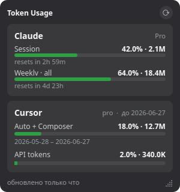

# apiwidget

A tiny always-on-top desktop widget for Linux that shows your **Claude** and **Cursor**
token usage at a glance — session/weekly limits, included usage, and renewal dates.
Built with C++/Qt6 for a minimal RAM/GPU footprint.



## What it shows

- **Claude** — plan, current-session usage % (with reset countdown), weekly all-models %.
- **Cursor** — plan, included-usage % (Auto + Composer / API tokens), billing period.

Quota bars turn yellow above 70% and red above 90%.

## How it gets the data

It reuses **your own local login on the same machine**: the Claude Code OAuth token under
`~/.claude` and the Cursor session token from Cursor's local `state.vscdb`. With those it
calls the same private endpoints the official apps use, read-only, every N minutes.

- No credentials are bundled in this repository.
- Nothing is sent anywhere except to Anthropic's and Cursor's own servers.
- The collected values are cached in `~/.cache/apiwidget/state.json` for an instant start.

> These endpoints are unofficial and may change. The widget degrades gracefully — it keeps
> the last-known values and marks them as “from cache”.

## Build

Requires `qt6-base-dev` (Widgets, Network, Sql), CMake ≥ 3.16 and a C++17 compiler.

```bash
cmake -S . -B build
cmake --build build -j
./build/apiwidget
```

A prebuilt Linux x86-64 binary is in [`prebuilt/`](prebuilt/) (needs the Qt6 runtime libraries).

## Tests

Pure-logic regression tests (no network, no credentials):

```bash
ctest --test-dir build
```

## Usage

- Drag with the left mouse button; resize from the bottom-right corner.
- Right-click for settings: refresh interval, opacity, always-on-top, start-on-login.

## Notes

Targets Linux / Wayland (GNOME). On Wayland the window floats on top and the compositor
controls stacking; on an X11 session it can sit on the desktop layer behind other windows.
